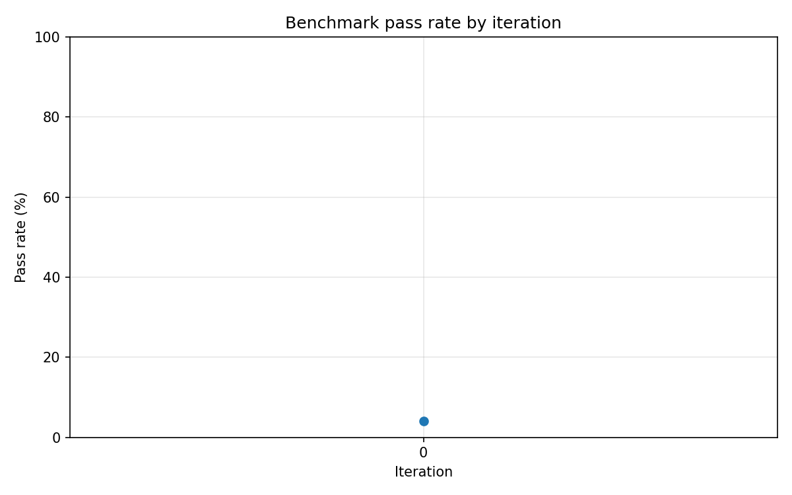

# Malatang — Self-Improving Bug-Fix Agent Harness

**AMD Developer Hackathon ACT II · Unicorn track**

An agent that fixes bugs, measures its pass rate on a frozen benchmark, and gets better between runs by rewriting its own strategy playbook from sandbox-verified wins and failures. **The product is the harness and the measured improvement curve, not the bug fixer itself.**

## Operational definition of "self-improving"

Malatang claims self-improvement **if and only if** all four conditions hold:

1. **Same benchmark.** Every iteration runs the identical, frozen set of seeded bugs.
2. **Automatic verification.** A fix counts as a pass only if the build succeeds and the test suite passes in a sandbox. No human judging, no LLM vibes as ground truth.
3. **Rising pass rate.** Iteration N+1 pass rate > iteration N pass rate, measured on the same set (the SOW target; see submitted results below for what we actually measured).
4. **Self-modification between runs.** The only thing that changes between iterations is something the system changed about itself (playbook at Level 1; model weights at Level 2 stretch).



The chart is generated only from `results/metrics.jsonl`. Full project spec: [`SOW.md`](SOW.md). Evidence audit: [`docs/BENCHMARK_EVIDENCE_PROVENANCE.md`](docs/BENCHMARK_EVIDENCE_PROVENANCE.md).

### Submitted benchmark results (AMD notebook, honest)

On the frozen 25-bug training set, pass rate went **40% → 40% → 36% → 48%** — intermediate iterations were noisy and **not** monotonically improving. Final training pass rate improved from **40% to 48%**. On the five-bug hold-out (run once with playbook v3), pass rate was **60%** (3/5).

- **`playbook/v1.md` is a dry-run** (`scripts.reflect --iteration 0 --dry-run`), not a live Fireworks rewrite. Do not claim otherwise.
- Committed `playbook/v2.md` and `playbook/v3.md` are **truncated** in the repository; live runs used them as-is. See the provenance doc for SHA-256 hashes and notebook export steps.
- Production trajectories are **not** in git; use `scripts/notebook_export_evidence.sh` on the notebook to archive them.

---

## Architecture

```
                 Benchmark Runner  (metrics, iterations)
                        │
         mutation JSON   │   verdict JSON
    Creator AI ◀───────┼───────▶ Judge AI
    (playbook + vLLM)  │        (sandbox + tests)
                        │
                 trajectories → reflection → new playbook
```

- **Creator → Judge:** `contracts/mutation.schema.json`
- **Judge → Creator:** `contracts/verdict.schema.json`
- **Runner metrics:** `results/metrics.jsonl` → `results/pass_rate.png`

Team split and runbooks: [`SOW.md`](SOW.md) · Judge/harness guide: [`JudgeREADME.md`](JudgeREADME.md)

---

## Quickstart

### Prerequisites

- Node.js 18+
- Python 3.12
- Git

### Setup

```bash
git clone https://github.com/joshnaim1/malatang.git
cd malatang
cp .env.example .env        # fill in values; never commit .env
npm install
python -m pip install -r requirements.txt
```

Required env vars (fail loudly if missing):

| Variable | Purpose |
|---|---|
| `SANDBOX_TIMEOUT_S` | Sandbox build+test timeout (default 120) |
| `BENCHMARK_ATTEMPTS_PER_BUG` | Max fix attempts per bug (default 8) |

See [`.env.example`](.env.example) for full list (Fireworks, vLLM, etc.).

### Verify locally without GPU or API calls

```bash
npm run build
npm test                    # 23 vitest tests
pytest
python -m harness.validate_bugs
python -m harness.live_heal --bug-id syntax-001 --creator mock
python -m harness.runner --creator fake --fresh
```

Creator backends: `fake` (self-contained stub), `mock` (Creator pipeline + canned fix, no GPU), `live` (Qwen2.5-Coder-7B on vLLM). The Creator normalizes fix diffs with `--- a/` / `+++ b/` headers before they reach the Judge (`creator/diff_utils.py`). The Judge verdict is always the deterministic build+tests gate.

### Live run on AMD AI Notebooks

The run used an **AMD Radeon Pro W7900 (`gfx1100`, 48 GB)** through [AMD AI Notebooks](https://notebooks.amd.com/hackathon), with ROCm and vLLM serving `Qwen/Qwen2.5-Coder-7B-Instruct`. vLLM and the harness run on the same JupyterLab machine over `localhost:8090`; Fireworks handles the lower-volume reflection call.

```bash
git clone https://github.com/joshnaim1/malatang && cd malatang
cp .env.example .env              # fill Fireworks values; never commit
npm install
bash scripts/notebook_setup.sh
python -m scripts.check_vllm
python -m harness.live_heal --bug-id syntax-001 --creator live
python -m harness.runner --creator live --fresh
python -m scripts.audit_wins
python -m scripts.reflect --iteration 0
python -m harness.runner --creator live --start-iteration 1

# Repeat reflect + runner for subsequent iterations, then evaluate hold-out once:
python -m scripts.audit_wins
python -m harness.holdout_eval --creator live
python -m harness.chart
```

`scripts.reflect --dry-run` validates plumbing but is explicitly not evidence of self-improvement. Hold-out results are isolated in `results/holdout.jsonl`; they never enter the training curve.

---

## Repo layout

| Path | What |
|---|---|
| `src/`, `lib/` | Vite + React demo app + vitest suite |
| `benchmark/bugs/` | 25 training bugs (patch files) |
| `benchmark/holdout/` | 5 hold-out bugs (eval only, not in training loop) |
| `contracts/` | Frozen JSON schemas + examples |
| `creator/` | Creator pipeline (Observer → Fix → mutation); diff normalization |
| `harness/` | Sandbox, Judge, Runner, chart (Python) |
| `scripts/` | Notebook bootstrap, vLLM/Fireworks health checks, Creator e2e |
| `results/` | Training `metrics.jsonl`, isolated `holdout.jsonl`, and `pass_rate.png` |

---

## Benchmark

- **25 training bugs** across 5 learnable classes (syntax, off-by-one, null, Intl.NumberFormat misuse, async)
- **5 hold-out bugs** — never shown during iterations; run once at the end
- **Calibration target:** iteration-0 pass rate **20–45%** with the real Creator (harden bugs, never loosen tests)

---

## AMD stack (submission axis)

| Component | Role |
|---|---|
| AMD Radeon Pro W7900 (`gfx1100`, 48 GB) | Hackathon GPU through AMD AI Notebooks |
| ROCm + vLLM + Qwen2.5-Coder-7B | Self-hosted Creator fix generation |
| Fireworks API | Bounded reflection + playbook rewriting |
| This repo | Deterministic sandbox verification + benchmark Runner |

---

## License

MIT — see [`LICENSE`](LICENSE).
